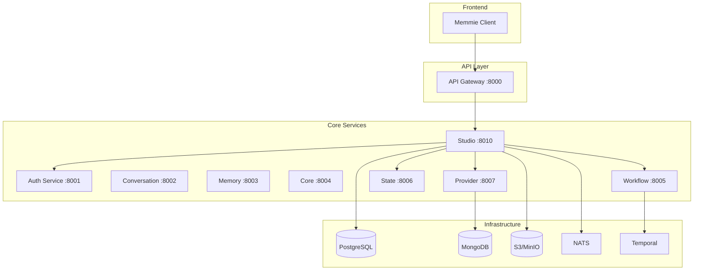

# Memmie Studio - Technical Architecture

## System Integration

### Integration with Existing Memmie Services



## Delta-Based Architecture

### Delta Event Sourcing

The entire blob state is reconstructed from an immutable sequence of deltas:

```go
// Delta represents an atomic change to a blob
type Delta struct {
    ID         uuid.UUID              `json:"id"`
    BlobID     uuid.UUID              `json:"blob_id"`
    ProviderID string                 `json:"provider_id"`
    UserID     uuid.UUID              `json:"user_id"`
    Operation  DeltaOperation         `json:"operation"`
    
    // For content changes
    Patch      json.RawMessage        `json:"patch,omitempty"`
    
    // For structural changes
    ParentID   *uuid.UUID             `json:"parent_id,omitempty"`
    ChildIDs   []uuid.UUID            `json:"child_ids,omitempty"`
    
    // Causality tracking
    CausedBy   *uuid.UUID             `json:"caused_by,omitempty"` // Previous delta
    Version    int                    `json:"version"`
    
    // Metadata
    Metadata   map[string]interface{} `json:"metadata"`
    CreatedAt  time.Time              `json:"created_at"`
    AppliedAt  *time.Time             `json:"applied_at,omitempty"`
}

type DeltaOperation string

const (
    OpCreate    DeltaOperation = "create"
    OpUpdate    DeltaOperation = "update"
    OpTransform DeltaOperation = "transform"
    OpDelete    DeltaOperation = "delete"
    OpRevert    DeltaOperation = "revert"
)
```

### Blob State Materialization

```go
// BlobState represents the current state of a blob
type BlobState struct {
    ID          uuid.UUID
    UserID      uuid.UUID
    Content     []byte
    ContentType string
    Version     int
    
    // DAG relationships
    ParentID    *uuid.UUID
    ChildIDs    []uuid.UUID
    
    // Provider tracking
    ProcessedBy map[string]ProcessingStatus
    
    // Computed from deltas
    CreatedAt   time.Time
    UpdatedAt   time.Time
    DeletedAt   *time.Time
}

// Materialize rebuilds blob state from deltas
func (s *StudioService) Materialize(blobID uuid.UUID) (*BlobState, error) {
    deltas, err := s.deltaRepo.GetDeltaChain(blobID)
    if err != nil {
        return nil, err
    }
    
    state := &BlobState{
        ID:          blobID,
        ProcessedBy: make(map[string]ProcessingStatus),
    }
    
    for _, delta := range deltas {
        if err := s.applyDelta(state, delta); err != nil {
            return nil, fmt.Errorf("failed to apply delta %s: %w", delta.ID, err)
        }
    }
    
    return state, nil
}
```

## Provider Workflow Integration

### Pivoting the Workflow Service

The existing Temporal-based workflow service will be extended with Studio-specific workflows:

```go
// Provider workflow definition
package workflows

import (
    "time"
    "go.temporal.io/sdk/workflow"
)

// ProviderProcessingWorkflow handles blob processing for a provider
func ProviderProcessingWorkflow(ctx workflow.Context, input ProviderInput) (*ProviderOutput, error) {
    options := workflow.ActivityOptions{
        StartToCloseTimeout: 30 * time.Second,
        RetryPolicy: &temporal.RetryPolicy{
            MaximumAttempts: 3,
        },
    }
    ctx = workflow.WithActivityOptions(ctx, options)
    
    // Step 1: Fetch blob and validate
    var blob BlobState
    err := workflow.ExecuteActivity(ctx, FetchBlobActivity, input.BlobID).Get(ctx, &blob)
    if err != nil {
        return nil, err
    }
    
    // Step 2: Check if processing is needed
    var shouldProcess bool
    err = workflow.ExecuteActivity(ctx, CheckProcessingNeededActivity, input).Get(ctx, &shouldProcess)
    if err != nil {
        return nil, err
    }
    
    if !shouldProcess {
        return &ProviderOutput{Skipped: true}, nil
    }
    
    // Step 3: Execute provider-specific transformation
    var transformResult TransformResult
    err = workflow.ExecuteActivity(ctx, ExecuteProviderTransformActivity, input).Get(ctx, &transformResult)
    if err != nil {
        return nil, err
    }
    
    // Step 4: Generate delta
    var delta Delta
    err = workflow.ExecuteActivity(ctx, GenerateDeltaActivity, transformResult).Get(ctx, &delta)
    if err != nil {
        return nil, err
    }
    
    // Step 5: Apply delta to blob store
    err = workflow.ExecuteActivity(ctx, ApplyDeltaActivity, delta).Get(ctx, nil)
    if err != nil {
        return nil, err
    }
    
    // Step 6: Trigger downstream providers (if needed)
    if transformResult.CreatesDerivedBlob {
        workflow.ExecuteActivity(ctx, TriggerDownstreamProvidersActivity, delta.BlobID).Get(ctx, nil)
    }
    
    return &ProviderOutput{
        DeltaID:        delta.ID,
        ProcessedAt:    time.Now(),
        DerivedBlobIDs: transformResult.DerivedBlobIDs,
    }, nil
}
```

### Provider Registration

```go
// Provider represents a blob processor
type Provider struct {
    ID          string                 `json:"id"`
    Name        string                 `json:"name"`
    Description string                 `json:"description"`
    
    // Event subscriptions
    Events      []EventType            `json:"events"`
    BlobTypes   []string               `json:"blob_types"` // Content types to process
    
    // Workflow configuration
    WorkflowID  string                 `json:"workflow_id"`
    Config      map[string]interface{} `json:"config"`
    
    // Processing rules
    Rules       ProcessingRules        `json:"rules"`
    
    // Metadata
    Author      string                 `json:"author"`
    Version     string                 `json:"version"`
    CreatedAt   time.Time              `json:"created_at"`
    UpdatedAt   time.Time              `json:"updated_at"`
}

type ProcessingRules struct {
    MaxInputSize     int64    `json:"max_input_size"`
    MinInputSize     int64    `json:"min_input_size"`
    AllowedMimeTypes []string `json:"allowed_mime_types"`
    RequiredMetadata []string `json:"required_metadata"`
    ProcessOnEdit    bool     `json:"process_on_edit"`
    ProcessOnCreate  bool     `json:"process_on_create"`
    ProcessInParallel bool    `json:"process_in_parallel"`
}
```

## Event-Driven Architecture

### Event Types and Flow

```go
// Events emitted by Studio Service
type BlobEvent struct {
    Type      EventType              `json:"type"`
    BlobID    uuid.UUID              `json:"blob_id"`
    UserID    uuid.UUID              `json:"user_id"`
    DeltaID   uuid.UUID              `json:"delta_id"`
    Metadata  map[string]interface{} `json:"metadata"`
    Timestamp time.Time              `json:"timestamp"`
}

type EventType string

const (
    EventBlobCreated   EventType = "blob.created"
    EventBlobUpdated   EventType = "blob.updated"
    EventBlobDeleted   EventType = "blob.deleted"
    EventDeltaApplied  EventType = "delta.applied"
    EventProcessingComplete EventType = "processing.complete"
    EventProcessingFailed   EventType = "processing.failed"
)

// Event handler in Provider Service
func (p *ProviderService) HandleBlobEvent(event BlobEvent) error {
    // Find providers interested in this event
    providers, err := p.repo.GetProvidersForEvent(event.Type)
    if err != nil {
        return err
    }
    
    for _, provider := range providers {
        // Check if provider should process this blob
        if !p.shouldProcess(provider, event) {
            continue
        }
        
        // Trigger workflow
        workflowOptions := client.StartWorkflowOptions{
            ID:        fmt.Sprintf("%s-%s-%s", provider.ID, event.BlobID, event.DeltaID),
            TaskQueue: "studio-providers",
        }
        
        _, err := p.temporalClient.ExecuteWorkflow(
            context.Background(),
            workflowOptions,
            provider.WorkflowID,
            ProviderInput{
                ProviderID: provider.ID,
                BlobID:     event.BlobID,
                Event:      event,
            },
        )
        
        if err != nil {
            log.Error("Failed to start workflow", "provider", provider.ID, "error", err)
        }
    }
    
    return nil
}
```

## DAG Processing Engine

### DAG Structure and Operations

```go
// DAG represents the blob dependency graph
type DAG struct {
    Nodes map[uuid.UUID]*BlobNode
    Edges []*Edge
}

type BlobNode struct {
    BlobID     uuid.UUID
    UserID     uuid.UUID
    ProviderID string
    Parents    []uuid.UUID
    Children   []uuid.UUID
    Metadata   map[string]interface{}
}

type Edge struct {
    From       uuid.UUID
    To         uuid.UUID
    ProviderID string
    Transform  string
}

// DAGProcessor handles cascade updates
type DAGProcessor struct {
    dag         *DAG
    studioSvc   *StudioService
    workflowSvc *WorkflowService
}

// ProcessCascade handles updates propagating through the DAG
func (p *DAGProcessor) ProcessCascade(rootBlobID uuid.UUID, delta Delta) error {
    // Get all descendants
    descendants := p.dag.GetDescendants(rootBlobID)
    
    // Sort by depth for proper ordering
    sorted := p.topologicalSort(descendants)
    
    // Process each level in parallel
    for level := range p.groupByLevel(sorted) {
        var wg sync.WaitGroup
        errors := make(chan error, len(level))
        
        for _, node := range level {
            wg.Add(1)
            go func(n *BlobNode) {
                defer wg.Done()
                
                // Trigger reprocessing
                err := p.workflowSvc.TriggerProvider(n.ProviderID, n.BlobID, EventBlobUpdated)
                if err != nil {
                    errors <- fmt.Errorf("failed to process %s: %w", n.BlobID, err)
                }
            }(node)
        }
        
        wg.Wait()
        close(errors)
        
        // Collect errors
        for err := range errors {
            if err != nil {
                return err
            }
        }
    }
    
    return nil
}
```

## Example Provider Implementations

### Content Expander Provider

```go
// ContentExpanderProvider expands brief text into detailed content
type ContentExpanderProvider struct {
    aiClient *openai.Client
}

func (p *ContentExpanderProvider) Transform(ctx context.Context, blob BlobState) (*TransformResult, error) {
    // Check if blob is text
    if !strings.HasPrefix(blob.ContentType, "text/") {
        return nil, ErrUnsupportedContentType
    }
    
    // Get expansion prompt
    prompt := fmt.Sprintf(`
        Expand the following text into a detailed, well-structured piece:
        
        Original: %s
        
        Requirements:
        - Maintain the original meaning and intent
        - Add relevant details and examples
        - Use clear, engaging language
        - Structure with paragraphs
    `, string(blob.Content))
    
    // Call AI service
    response, err := p.aiClient.Complete(ctx, prompt)
    if err != nil {
        return nil, err
    }
    
    // Create new blob for expanded content
    newBlobID := uuid.New()
    
    return &TransformResult{
        CreatesDerivedBlob: true,
        DerivedBlobIDs:     []uuid.UUID{newBlobID},
        Delta: Delta{
            Operation: OpTransform,
            Patch: json.RawMessage(fmt.Sprintf(`{
                "action": "create_derived",
                "derived_blob_id": "%s",
                "content": %q,
                "transform": "expansion"
            }`, newBlobID, response)),
        },
    }, nil
}
```

### Grammar Checker Provider

```go
// GrammarCheckerProvider checks and fixes grammar
type GrammarCheckerProvider struct {
    grammarAPI *languagetool.Client
}

func (p *GrammarCheckerProvider) Transform(ctx context.Context, blob BlobState) (*TransformResult, error) {
    // Check grammar
    issues, err := p.grammarAPI.Check(ctx, string(blob.Content))
    if err != nil {
        return nil, err
    }
    
    if len(issues) == 0 {
        return &TransformResult{
            CreatesDerivedBlob: false,
            Delta: Delta{
                Operation: OpUpdate,
                Patch: json.RawMessage(`{"grammar_check": "passed"}`),
            },
        }, nil
    }
    
    // Apply corrections
    corrected := p.applyCorrections(string(blob.Content), issues)
    
    return &TransformResult{
        CreatesDerivedBlob: false,
        Delta: Delta{
            Operation: OpUpdate,
            Patch: json.RawMessage(fmt.Sprintf(`{
                "content": %q,
                "grammar_issues": %d,
                "auto_corrected": true
            }`, corrected, len(issues))),
        },
    }, nil
}
```

## Storage Strategy

### Hybrid Storage Model

```yaml
# Blob content storage
content_storage:
  small_blobs:  # < 1MB
    backend: postgresql
    table: blob_content
    compression: lz4
  
  large_blobs:  # >= 1MB
    backend: s3
    bucket: memmie-studio-blobs
    presigned_url_ttl: 3600

# Delta storage
delta_storage:
  backend: postgresql  # Always in DB for consistency
  table: deltas
  partitioning: range  # By created_at
  retention: infinite  # Never delete deltas

# Materialized views
cache:
  backend: redis
  ttl: 300  # 5 minutes
  key_pattern: "studio:blob:{user_id}:{blob_id}:v{version}"
```

## Performance Optimizations

### 1. Delta Compression
- Store only differences, not full content
- Use JSON Patch (RFC 6902) for structured data
- Binary diff for large content

### 2. Materialized View Caching
- Cache frequently accessed blob states
- Invalidate on delta application
- Background refresh for hot blobs

### 3. DAG Processing Optimization
- Parallel processing at each level
- Skip unchanged branches
- Memoization of provider results

### 4. Event Batching
- Batch multiple events to same provider
- Deduplicate redundant events
- Priority queue for time-sensitive providers

## Security Model

### Access Control
```go
type BlobPermission struct {
    UserID     uuid.UUID
    BlobID     uuid.UUID
    Permission string // read, write, delete, share
    GrantedBy  uuid.UUID
    GrantedAt  time.Time
}

// Check permission before any operation
func (s *StudioService) checkPermission(userID, blobID uuid.UUID, perm string) error {
    // User owns their blobs
    blob, err := s.getBlob(blobID)
    if err != nil {
        return err
    }
    
    if blob.UserID == userID {
        return nil
    }
    
    // Check explicit permissions
    hasPermission, err := s.permRepo.HasPermission(userID, blobID, perm)
    if err != nil {
        return err
    }
    
    if !hasPermission {
        return ErrUnauthorized
    }
    
    return nil
}
```

### Provider Sandboxing
- Providers run in isolated Temporal workers
- Resource limits (CPU, memory, time)
- No direct database access
- All operations through controlled APIs

## Monitoring and Observability

### Key Metrics
```go
// Prometheus metrics
var (
    deltasApplied = prometheus.NewCounterVec(
        prometheus.CounterOpts{
            Name: "studio_deltas_applied_total",
            Help: "Total number of deltas applied",
        },
        []string{"user_id", "provider_id", "operation"},
    )
    
    blobProcessingDuration = prometheus.NewHistogramVec(
        prometheus.HistogramOpts{
            Name: "studio_blob_processing_duration_seconds",
            Help: "Time taken to process a blob",
        },
        []string{"provider_id"},
    )
    
    dagDepth = prometheus.NewGaugeVec(
        prometheus.GaugeOpts{
            Name: "studio_dag_depth",
            Help: "Maximum depth of blob DAG",
        },
        []string{"user_id"},
    )
)
```

### Distributed Tracing
```go
// OpenTelemetry integration
func (s *StudioService) ApplyDelta(ctx context.Context, delta Delta) error {
    ctx, span := tracer.Start(ctx, "studio.apply_delta",
        trace.WithAttributes(
            attribute.String("delta.id", delta.ID.String()),
            attribute.String("blob.id", delta.BlobID.String()),
            attribute.String("operation", string(delta.Operation)),
        ),
    )
    defer span.End()
    
    // ... implementation
}
```

## Migration Path from Workflow Service

The current workflow service can be gradually migrated:

1. **Phase 1**: Add Studio-specific workflows alongside existing ones
2. **Phase 2**: Implement provider registry in Provider Service
3. **Phase 3**: Connect Studio Service to Temporal
4. **Phase 4**: Migrate applicable workflows to provider model
5. **Phase 5**: Deprecate old workflow patterns

This architecture provides a solid foundation for a reactive, versioned, DAG-based blob processing system that integrates seamlessly with the existing Memmie platform.