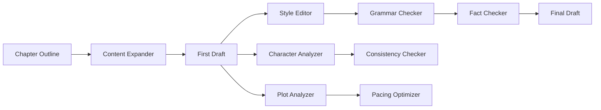

# Memmie Studio Use Cases & Examples

## 1. Book Writing Assistant

### Overview
A comprehensive system for authors to write, edit, and refine books with AI-powered assistance.

### Workflow


### Implementation
```go
// Book project structure
type BookProject struct {
    ID          uuid.UUID
    UserID      uuid.UUID
    Title       string
    
    // Blob references
    OutlineBlob uuid.UUID
    Chapters    map[int]ChapterBlobs
    Characters  map[string]uuid.UUID
    
    // Metadata
    Genre       string
    TargetWords int
    Style       WritingStyle
}

type ChapterBlobs struct {
    Outline    uuid.UUID
    Draft      uuid.UUID
    Edited     uuid.UUID
    Final      uuid.UUID
    Notes      uuid.UUID
}

// Chapter creation workflow
func CreateChapter(ctx context.Context, project *BookProject, chapterNum int, outline string) error {
    // 1. Create outline blob
    outlineBlob, err := studio.CreateBlob(ctx, CreateBlobInput{
        UserID:  project.UserID,
        Content: []byte(outline),
        Type:    "text/markdown",
        Metadata: map[string]interface{}{
            "project_id": project.ID,
            "chapter":    chapterNum,
            "stage":      "outline",
        },
    })
    
    // 2. Trigger content expander (automatic via event)
    // Provider: content-expander
    // Creates: draft blob as child
    
    // 3. Style editing (automatic)
    // Provider: style-editor
    // Creates: styled blob as child of draft
    
    // 4. Grammar checking (automatic)
    // Provider: grammar-checker
    // Updates: styled blob with corrections
    
    // 5. Store references
    project.Chapters[chapterNum] = ChapterBlobs{
        Outline: outlineBlob.ID,
        // Others filled by provider events
    }
    
    return nil
}
```

### Example Providers for Book Writing

#### Character Consistency Analyzer
```go
type CharacterAnalyzer struct {
    BaseProvider
}

func (p *CharacterAnalyzer) Process(ctx context.Context, input ProcessInput) (*ProcessOutput, error) {
    chapter := string(input.Blob.Content)
    
    // Extract character mentions and descriptions
    characters := p.extractCharacters(chapter)
    
    // Check against character database
    inconsistencies := []Inconsistency{}
    for _, char := range characters {
        profile, _ := p.getCharacterProfile(char.Name)
        if profile != nil {
            // Check for inconsistencies
            if char.EyeColor != "" && char.EyeColor != profile.EyeColor {
                inconsistencies = append(inconsistencies, Inconsistency{
                    Character: char.Name,
                    Type:      "appearance",
                    Expected:  profile.EyeColor,
                    Found:     char.EyeColor,
                })
            }
        }
    }
    
    // Generate report
    report := p.generateReport(inconsistencies)
    
    return &ProcessOutput{
        Type: OutputTypeMetadata,
        Metadata: map[string]interface{}{
            "characters_found": len(characters),
            "inconsistencies":  inconsistencies,
            "report":          report,
        },
    }, nil
}
```

#### Plot Coherence Checker
```go
type PlotCoherenceChecker struct {
    BaseProvider
}

func (p *PlotCoherenceChecker) Process(ctx context.Context, input ProcessInput) (*ProcessOutput, error) {
    // Analyze plot elements
    plot := p.analyzePlot(input.Blob.Content)
    
    // Check for common issues
    issues := []PlotIssue{}
    
    // Unresolved threads
    if threads := p.findUnresolvedThreads(plot); len(threads) > 0 {
        issues = append(issues, PlotIssue{
            Type: "unresolved_thread",
            Elements: threads,
        })
    }
    
    // Timeline inconsistencies
    if timeline := p.checkTimeline(plot); !timeline.Consistent {
        issues = append(issues, PlotIssue{
            Type: "timeline_error",
            Details: timeline.Errors,
        })
    }
    
    return &ProcessOutput{
        Type: OutputTypeMetadata,
        Metadata: map[string]interface{}{
            "plot_elements": plot,
            "issues":        issues,
            "coherence_score": p.calculateCoherence(plot, issues),
        },
    }, nil
}
```

## 2. Academic Research Assistant

### Overview
Helps researchers organize, analyze, and synthesize academic content.

### Workflow
```yaml
research_pipeline:
  steps:
    - name: source_ingestion
      providers:
        - pdf_extractor
        - citation_parser
        - abstract_summarizer
    
    - name: analysis
      providers:
        - methodology_analyzer
        - results_extractor
        - statistical_validator
    
    - name: synthesis
      providers:
        - literature_reviewer
        - gap_identifier
        - hypothesis_generator
    
    - name: writing
      providers:
        - academic_writer
        - citation_formatter
        - plagiarism_checker
```

### Implementation
```go
type ResearchProject struct {
    ID       uuid.UUID
    UserID   uuid.UUID
    Title    string
    Field    string
    
    // Blob collections
    Sources     []SourceDocument
    Notes       []uuid.UUID
    Synthesis   uuid.UUID
    Manuscript  uuid.UUID
}

type SourceDocument struct {
    BlobID      uuid.UUID
    Type        string // paper, book, article
    
    // Extracted metadata
    Title       string
    Authors     []string
    Year        int
    DOI         string
    
    // Analysis results
    Summary     uuid.UUID
    KeyFindings []uuid.UUID
    Methodology uuid.UUID
}

// Literature review generation
func GenerateLiteratureReview(ctx context.Context, project *ResearchProject) (*Blob, error) {
    // 1. Collect all source summaries
    summaries := []string{}
    for _, source := range project.Sources {
        if source.Summary != uuid.Nil {
            blob, _ := studio.GetBlob(ctx, source.Summary)
            summaries = append(summaries, string(blob.Content))
        }
    }
    
    // 2. Create synthesis request
    synthesisInput := map[string]interface{}{
        "summaries": summaries,
        "field":     project.Field,
        "focus":     project.Title,
    }
    
    // 3. Create blob for synthesis
    synthesisBlob, err := studio.CreateBlob(ctx, CreateBlobInput{
        UserID:  project.UserID,
        Content: []byte(json.Marshal(synthesisInput)),
        Type:    "application/json",
        Metadata: map[string]interface{}{
            "project_id": project.ID,
            "type":       "literature_review_request",
        },
    })
    
    // Provider chain will:
    // - literature_reviewer: Generate review
    // - gap_identifier: Find research gaps
    // - hypothesis_generator: Suggest hypotheses
    
    return synthesisBlob, err
}
```

### Research-Specific Providers

#### Citation Network Analyzer
```go
func (p *CitationNetworkAnalyzer) Process(ctx context.Context, input ProcessInput) (*ProcessOutput, error) {
    // Parse citations from document
    citations := p.extractCitations(input.Blob.Content)
    
    // Build citation network
    network := &CitationNetwork{
        Nodes: make(map[string]*Paper),
        Edges: make([]*Citation, 0),
    }
    
    for _, cite := range citations {
        // Fetch paper metadata
        paper := p.fetchPaperMetadata(cite)
        network.Nodes[paper.ID] = paper
        
        // Add citation edge
        network.Edges = append(network.Edges, &Citation{
            From: input.Blob.ID.String(),
            To:   paper.ID,
            Type: cite.Type, // supporting, contradicting, extending
        })
    }
    
    // Analyze network
    analysis := p.analyzeNetwork(network)
    
    return &ProcessOutput{
        Type: OutputTypeNewBlob,
        Content: []byte(p.visualizeNetwork(network)),
        Metadata: map[string]interface{}{
            "citation_count": len(citations),
            "influential_papers": analysis.MostCited,
            "research_clusters": analysis.Clusters,
        },
    }, nil
}
```

## 3. Code Documentation Generator

### Overview
Automatically generates and maintains documentation for codebases.

### Workflow
```go
type CodeDocumentationWorkflow struct {
    studio *StudioService
}

func (w *CodeDocumentationWorkflow) DocumentCodebase(ctx context.Context, repoPath string) error {
    // 1. Scan codebase
    files := w.scanRepository(repoPath)
    
    for _, file := range files {
        // 2. Create blob for source code
        codeBlob, _ := w.studio.CreateBlob(ctx, CreateBlobInput{
            Content: file.Content,
            Type:    file.MimeType,
            Metadata: map[string]interface{}{
                "path":     file.Path,
                "language": file.Language,
            },
        })
        
        // Automatic provider chain:
        // - code_parser: Extract functions, classes
        // - doc_generator: Generate documentation
        // - example_creator: Create usage examples
        // - diagram_generator: Create architecture diagrams
    }
    
    return nil
}
```

### Code Documentation Providers

#### API Documentation Generator
```go
func (p *APIDocGenerator) Process(ctx context.Context, input ProcessInput) (*ProcessOutput, error) {
    code := string(input.Blob.Content)
    lang := input.Blob.Metadata["language"].(string)
    
    // Parse code based on language
    var apis []APIEndpoint
    switch lang {
    case "go":
        apis = p.parseGoAPIs(code)
    case "python":
        apis = p.parsePythonAPIs(code)
    case "javascript":
        apis = p.parseJSAPIs(code)
    }
    
    // Generate OpenAPI spec
    spec := p.generateOpenAPISpec(apis)
    
    // Generate markdown documentation
    markdown := p.generateMarkdownDocs(apis)
    
    return &ProcessOutput{
        Type: OutputTypeMultiple,
        Outputs: []Output{
            {
                Type:    "openapi",
                Content: []byte(spec),
            },
            {
                Type:    "markdown",
                Content: []byte(markdown),
            },
        },
    }, nil
}
```

## 4. Content Localization Pipeline

### Overview
Translates and adapts content for different markets and cultures.

### Implementation
```go
type LocalizationPipeline struct {
    studio     *StudioService
    providers  []string
    languages  []string
    markets    []Market
}

type Market struct {
    Code      string
    Language  string
    Country   string
    Currency  string
    DateFormat string
}

func (p *LocalizationPipeline) Localize(ctx context.Context, contentBlob *Blob) (map[string]*Blob, error) {
    localized := make(map[string]*Blob)
    
    for _, market := range p.markets {
        // 1. Translate content
        translated := p.translate(ctx, contentBlob, market.Language)
        
        // 2. Adapt cultural references
        adapted := p.adaptCultural(ctx, translated, market)
        
        // 3. Convert units and currencies
        converted := p.convertUnits(ctx, adapted, market)
        
        // 4. Adjust formatting
        formatted := p.adjustFormatting(ctx, converted, market)
        
        localized[market.Code] = formatted
    }
    
    return localized, nil
}
```

## 5. Legal Document Analyzer

### Overview
Analyzes contracts and legal documents for key terms, risks, and obligations.

### Providers
```yaml
legal_analysis_chain:
  providers:
    - contract_parser:
        extracts:
          - parties
          - terms
          - obligations
          - deadlines
    
    - risk_analyzer:
        identifies:
          - liability_clauses
          - penalty_clauses
          - termination_conditions
          - dispute_resolution
    
    - compliance_checker:
        checks:
          - regulatory_compliance
          - standard_clauses
          - missing_provisions
    
    - plain_english_translator:
        converts:
          - legal_jargon
          - complex_sentences
          - technical_terms
```

## 6. Educational Content Creator

### Overview
Transforms content into educational materials with different learning styles.

### Implementation
```go
type EducationalContentCreator struct {
    studio *StudioService
}

func (c *EducationalContentCreator) CreateLearningMaterials(ctx context.Context, sourceBlob *Blob) (*LearningPackage, error) {
    pkg := &LearningPackage{
        SourceID: sourceBlob.ID,
    }
    
    // 1. Create lesson plan
    lessonPlan := c.generateLessonPlan(ctx, sourceBlob)
    pkg.LessonPlan = lessonPlan.ID
    
    // 2. Generate quiz questions
    quiz := c.generateQuiz(ctx, sourceBlob)
    pkg.Quiz = quiz.ID
    
    // 3. Create flashcards
    flashcards := c.generateFlashcards(ctx, sourceBlob)
    pkg.Flashcards = flashcards.ID
    
    // 4. Generate visual aids
    visuals := c.generateVisuals(ctx, sourceBlob)
    pkg.Visuals = visuals.ID
    
    // 5. Create practice exercises
    exercises := c.generateExercises(ctx, sourceBlob)
    pkg.Exercises = exercises.ID
    
    return pkg, nil
}
```

## 7. Social Media Content Optimizer

### Overview
Adapts content for different social media platforms with platform-specific optimizations.

### Platform Adapters
```go
type SocialMediaOptimizer struct {
    platforms map[string]PlatformAdapter
}

type PlatformAdapter interface {
    Adapt(content *Blob) (*Blob, error)
    Validate(content *Blob) error
    GetConstraints() Constraints
}

type TwitterAdapter struct{}

func (a *TwitterAdapter) Adapt(content *Blob) (*Blob, error) {
    text := string(content.Content)
    
    // 1. Shorten to 280 characters
    shortened := a.intelligentShorten(text, 280)
    
    // 2. Add hashtags
    withHashtags := a.addRelevantHashtags(shortened)
    
    // 3. Optimize for engagement
    optimized := a.optimizeForEngagement(withHashtags)
    
    return &Blob{
        Content: []byte(optimized),
        Metadata: map[string]interface{}{
            "platform": "twitter",
            "char_count": len(optimized),
        },
    }, nil
}
```

## 8. Data Analysis Pipeline

### Overview
Processes raw data through analysis, visualization, and insight generation.

### Implementation
```go
type DataAnalysisPipeline struct {
    studio *StudioService
}

func (p *DataAnalysisPipeline) AnalyzeData(ctx context.Context, dataBlob *Blob) (*AnalysisResults, error) {
    results := &AnalysisResults{}
    
    // 1. Data validation and cleaning
    cleaned := p.cleanData(ctx, dataBlob)
    
    // 2. Statistical analysis
    stats := p.performStatistics(ctx, cleaned)
    results.Statistics = stats
    
    // 3. Pattern detection
    patterns := p.detectPatterns(ctx, cleaned)
    results.Patterns = patterns
    
    // 4. Visualization generation
    charts := p.generateVisualizations(ctx, cleaned, stats)
    results.Visualizations = charts
    
    // 5. Insight generation
    insights := p.generateInsights(ctx, stats, patterns)
    results.Insights = insights
    
    // 6. Report generation
    report := p.generateReport(ctx, results)
    results.Report = report
    
    return results, nil
}
```

## 9. Email Campaign Optimizer

### Overview
Optimizes email content for different segments and purposes.

### Segmentation and Personalization
```go
type EmailCampaignOptimizer struct {
    studio *StudioService
}

func (o *EmailCampaignOptimizer) OptimizeEmail(ctx context.Context, template *Blob, segments []Segment) (map[string]*Blob, error) {
    optimized := make(map[string]*Blob)
    
    for _, segment := range segments {
        // 1. Personalize content
        personalized := o.personalizeForSegment(ctx, template, segment)
        
        // 2. Optimize subject line
        withSubject := o.optimizeSubjectLine(ctx, personalized, segment)
        
        // 3. A/B test variations
        variations := o.generateABVariations(ctx, withSubject)
        
        // 4. Spam check
        checked := o.checkSpamScore(ctx, variations)
        
        optimized[segment.ID] = checked
    }
    
    return optimized, nil
}
```

## 10. Meeting Transcription Processor

### Overview
Processes meeting recordings into actionable outputs.

### Processing Pipeline
```go
type MeetingProcessor struct {
    studio *StudioService
}

func (p *MeetingProcessor) ProcessMeeting(ctx context.Context, recording *Blob) (*MeetingOutputs, error) {
    outputs := &MeetingOutputs{}
    
    // 1. Transcribe audio
    transcript := p.transcribe(ctx, recording)
    outputs.Transcript = transcript
    
    // 2. Identify speakers
    withSpeakers := p.identifySpeakers(ctx, transcript)
    
    // 3. Extract action items
    actions := p.extractActionItems(ctx, withSpeakers)
    outputs.ActionItems = actions
    
    // 4. Generate summary
    summary := p.generateSummary(ctx, withSpeakers)
    outputs.Summary = summary
    
    // 5. Extract decisions
    decisions := p.extractDecisions(ctx, withSpeakers)
    outputs.Decisions = decisions
    
    // 6. Create follow-up tasks
    tasks := p.createTasks(ctx, actions, decisions)
    outputs.Tasks = tasks
    
    return outputs, nil
}
```

These use cases demonstrate the versatility and power of the Memmie Studio system for various content processing scenarios.