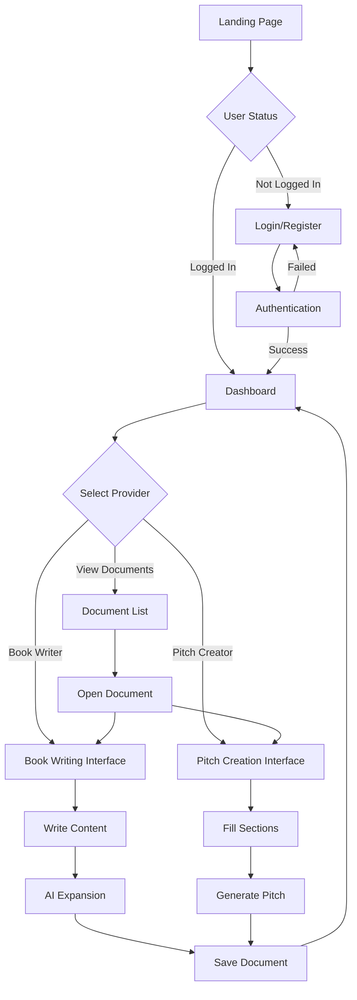

# ReYNa Studio (RYN) UI Mockups & User Flows

## 1. Overall User Journey



## 2. Login/Register Screen

```
┌─────────────────────────────────────────────────────────────┐
│                        ReYNa STUDIO                          │
│                                                              │
│                    ╭─────────────────╮                      │
│                    │   Sign In        │                      │
│                    ╰─────────────────╯                      │
│                                                              │
│                  ┌─────────────────────┐                    │
│                  │ Email               │                    │
│                  └─────────────────────┘                    │
│                                                              │
│                  ┌─────────────────────┐                    │
│                  │ Password            │                    │
│                  └─────────────────────┘                    │
│                                                              │
│                  [────── Sign In ──────]                    │
│                                                              │
│                  Don't have an account?                      │
│                       Sign Up →                              │
│                                                              │
└─────────────────────────────────────────────────────────────┘

Color Scheme: 
- Background: #0a0a0a (near black)
- Card: #1a1a1a (dark gray)
- Input fields: #0a0a0a with #333 border
- Primary button: #4a9eff (blue)
- Text: #ffffff (white), #888 (gray for secondary)
```

## 3. Dashboard (Home Screen)

```
┌─────────────────────────────────────────────────────────────┐
│ ReYNa STUDIO                                     Sign Out ▼ │
├─────────────────────────────────────────────────────────────┤
│                                                              │
│ ┌──────────────┐  ┌─────────────────────────────────────┐  │
│ │              │  │                                     │  │
│ │  PROVIDERS   │  │     Your Documents                  │  │
│ │              │  │                                     │  │
│ │ ○ All Docs   │  │  ┌───────────┐  ┌───────────┐     │  │
│ │              │  │  │           │  │           │     │  │
│ │ ○ Book       │  │  │  My Novel │  │ Business  │     │  │
│ │   Writer     │  │  │           │  │   Plan    │     │  │
│ │              │  │  │ Chapter 1 │  │           │     │  │
│ │ ○ Pitch      │  │  │           │  │ SaaS MVP  │     │  │
│ │   Creator    │  │  │ 2,341 wds │  │           │     │  │
│ │              │  │  └───────────┘  └───────────┘     │  │
│ │              │  │                                     │  │
│ │              │  │  ┌───────────┐  ┌───────────┐     │  │
│ │              │  │  │           │  │    + New  │     │  │
│ │              │  │  │ Chapter 2 │  │  Document │     │  │
│ │              │  │  │           │  │           │     │  │
│ │              │  │  │ 1,892 wds │  │           │     │  │
│ │              │  │  └───────────┘  └───────────┘     │  │
│ └──────────────┘  └─────────────────────────────────────┘  │
│                                                              │
└─────────────────────────────────────────────────────────────┘

Interaction:
- Click provider to filter documents
- Click document card to open
- Click "New Document" to create
- Hover effects on all interactive elements
```

## 4. Book Writer Interface (Split View)

```
┌─────────────────────────────────────────────────────────────┐
│ ← Back    [Chapter Title........................]   Save ▼ │
├─────────────────────────────────────────────────────────────┤
│                                                              │
│  YOUR WRITING                │  AI EXPANDED VERSION         │
│  1,234 words                 │  2,468 words                 │
│ ─────────────────────────────┼───────────────────────────── │
│                              │                              │
│  The storm hit without       │  The storm descended upon    │
│  warning. Captain Morrison   │  the vessel without warning, │
│  gripped the wheel as waves  │  its fury catching even the  │
│  crashed over the bow.       │  most seasoned sailors off   │
│                              │  guard. Captain Morrison,    │
│  The crew scrambled to       │  his weathered hands white-  │
│  secure the rigging.         │  knuckled around the ship's  │
│                              │  wheel, fought against the   │
│  Lightning illuminated the   │  relentless force of wind    │
│  angry sky.                  │  and water. Massive waves,   │
│                              │  some towering three stories │
│  ▌                           │  high, crashed over the bow  │
│                              │  with thunderous impacts...  │
│                              │                              │
│                              │  The crew, their shouts      │
│                              │  barely audible over the     │
│                              │  howling wind, scrambled     │
│                              │  across the slippery deck... │
│                              │                              │
├──────────────────────────────┴───────────────────────────────┤
│ □ Auto-expand    Last saved: 2:34 PM    Expansion: 200%     │
└─────────────────────────────────────────────────────────────┘

Features:
- Live typing on left
- Auto-expansion after 1.5s pause
- Word count tracking
- Save status indicator
- Expansion ratio display
```

## 5. Pitch Creator Interface (Structured)

```
┌─────────────────────────────────────────────────────────────┐
│ ← Back  [Pitch Title.......] [Company Name.......]  Save ▼ │
├─────────────────────────────────────────────────────────────┤
│                                                              │
│ SECTIONS          │  PROBLEM                   │ AI PITCH  │
│                   │                             │           │
│ ✓ 1. Problem      │  What problem are you      │ Preview   │
│ ✓ 2. Solution     │  solving? Who experiences   │           │
│ ○ 3. Market       │  this problem? How big is   │ Generate  │
│ ○ 4. Business     │  the problem?               │  Full     │
│ ○ 5. Competition  │                             │  Pitch    │
│ ○ 6. Team         │  ┌─────────────────────┐   │           │
│ ○ 7. Traction     │  │                     │   │ ┌───────┐ │
│ ○ 8. Funding      │  │ Small businesses    │   │ │       │ │
│                   │  │ waste 20% of their  │   │ │  Your │ │
│ Progress: 25%     │  │ time on manual      │   │ │ pitch │ │
│ ████──────────    │  │ inventory tracking. │   │ │  will │ │
│                   │  │ This costs them     │   │ │appear │ │
│                   │  │ $50K annually...    │   │ │  here │ │
│                   │  │                     │   │ │       │ │
│                   │  └─────────────────────┘   │ └───────┘ │
│                   │                             │           │
│                   │  [← Previous] [Next →]     │           │
│                   │                             │           │
└───────────────────┴─────────────────────────────┴───────────┘

Interaction Flow:
1. Click section in sidebar
2. Fill out text area
3. Navigate with Previous/Next
4. After 4+ sections → Generate button appears
5. View formatted pitch on right
```

## 6. User Flow: Creating a Book Chapter

```
Start
  │
  ▼
Dashboard
  │
  ├─→ Click "Book Writer" Provider
  │
  ├─→ Click "New Document"
  │
  ▼
Book Writer Interface
  │
  ├─→ Enter Chapter Title
  │
  ├─→ Start Typing Content
  │     │
  │     ├─→ Auto-expansion triggered (1.5s delay)
  │     │
  │     ├─→ AI processes text
  │     │
  │     └─→ Expanded text appears on right
  │
  ├─→ Continue Writing/Editing
  │
  ├─→ Click Save
  │     │
  │     ├─→ Original saved as blob
  │     │
  │     └─→ Expanded saved as child blob
  │
  └─→ Return to Dashboard
```

## 7. User Flow: Creating a Business Pitch

```
Start
  │
  ▼
Dashboard
  │
  ├─→ Click "Pitch Creator" Provider
  │
  ├─→ Click "New Document"
  │
  ▼
Pitch Creator Interface
  │
  ├─→ Enter Pitch Title & Company Name
  │
  ├─→ Navigate Through Sections
  │     │
  │     ├─→ Section 1: Problem
  │     ├─→ Section 2: Solution
  │     ├─→ Section 3: Market
  │     ├─→ Section 4: Business Model
  │     └─→ (Continue for all 8 sections)
  │
  ├─→ After 4+ Sections Filled
  │     │
  │     └─→ "Generate Full Pitch" Button Appears
  │
  ├─→ Click Generate
  │     │
  │     ├─→ AI processes all sections
  │     │
  │     └─→ Professional pitch appears on right
  │
  ├─→ Click Save
  │
  └─→ Return to Dashboard
```

## 8. Mobile Responsive View (iPhone)

```
┌─────────────┐
│ RYN      ☰  │
│             │
├─────────────┤
│             │
│ Your Docs   │
│             │
│ ┌─────────┐ │
│ │ My Novel│ │
│ │ Ch. 1   │ │
│ └─────────┘ │
│             │
│ ┌─────────┐ │
│ │ Pitch   │ │
│ │ SaaS    │ │
│ └─────────┘ │
│             │
│ ┌─────────┐ │
│ │  + New  │ │
│ └─────────┘ │
│             │
└─────────────┘

Book Writer (Mobile):
┌─────────────┐
│ ← Title   ✓ │
├─────────────┤
│ [Original│AI]│
├─────────────┤
│             │
│ Your text   │
│ here...     │
│             │
│             │
│             │
├─────────────┤
│ 234 words   │
└─────────────┘

Swipe to switch between
original and AI views
```

## 9. State Diagram: Document Lifecycle

```
stateDiagram-v2
    [*] --> Created: User creates document
    Created --> Editing: User types content
    Editing --> Processing: Auto-expand triggers
    Processing --> Processed: AI returns expansion
    Processed --> Editing: User continues editing
    Editing --> Saving: User clicks save
    Processed --> Saving: User clicks save
    Saving --> Saved: Document stored in MongoDB
    Saved --> Dashboard: Return to home
    Dashboard --> Viewing: User opens document
    Viewing --> Editing: User edits document
    Saved --> [*]: Session ends
```

## 10. Component Hierarchy

```
App
├── AuthProvider (Context)
│   ├── Login
│   └── Register
├── PrivateRoute
│   ├── Dashboard
│   │   ├── Sidebar
│   │   │   └── ProviderList
│   │   └── DocumentGrid
│   │       └── DocumentCard
│   ├── BookWriter
│   │   ├── Header
│   │   │   ├── TitleInput
│   │   │   └── SaveButton
│   │   ├── EditorPane
│   │   │   └── TextArea
│   │   ├── PreviewPane
│   │   │   └── ProcessedContent
│   │   └── Footer
│   │       └── Stats
│   └── PitchCreator
│       ├── Header
│       ├── SectionsNav
│       │   └── SectionItem
│       ├── EditorArea
│       │   └── SectionEditor
│       └── PreviewArea
│           └── GeneratedPitch
```

## 11. Data Flow Architecture

```
User Input
    │
    ▼
React Component
    │
    ├─→ Local State Update
    │
    ├─→ API Call (Studio Service :8010)
    │     │
    │     ├─→ Auth Check (Auth Service :8001)
    │     │
    │     ├─→ Store Blob (State Service :8006)
    │     │
    │     └─→ Process Content (Provider Service :8007)
    │           │
    │           └─→ OpenAI API
    │
    ├─→ Response Processing
    │
    └─→ UI Update
        │
        └─→ User Sees Result
```

## 12. Color Palette & Design System

```
Dark Theme Colors:
┌────────────────────────────────┐
│ Background:     #0a0a0a        │  ████ Nearly Black
│ Surface:        #1a1a1a        │  ████ Dark Gray
│ Border:         #333333        │  ████ Gray
│ Text Primary:   #ffffff        │  ████ White
│ Text Secondary: #888888        │  ████ Light Gray
│ Primary:        #4a9eff        │  ████ Blue
│ Success:        #4ade80        │  ████ Green
│ Warning:        #fbbf24        │  ████ Yellow
│ Error:          #f87171        │  ████ Red
└────────────────────────────────┘

Typography:
- Headers: System UI, -apple-system, sans-serif
- Body: System UI, -apple-system, sans-serif  
- Editor: Georgia, serif (for book writing)
- Code: Menlo, Monaco, monospace

Spacing:
- Base unit: 4px
- Padding: 16px (4 units)
- Margins: 20px (5 units)
- Border radius: 6px
```

## 13. Interaction Patterns

### Auto-Save Pattern
```
User Types → Debounce 1.5s → Process → Show Result
                ↓
         Local Save Draft
                ↓
         After 10s idle → Auto-save to backend
```

### Error Handling Flow
```
API Error
    │
    ├─→ Network Error → Show "Connection lost" toast
    │
    ├─→ Auth Error → Redirect to login
    │
    ├─→ Validation Error → Show inline error message
    │
    └─→ Server Error → Show error modal with retry
```

### Loading States
```
1. Initial Load:    Skeleton screens
2. Processing:      Spinner with message
3. Saving:          Progress indicator
4. Background:      Subtle status indicator
```

## Key UX Principles

1. **Immediate Feedback**: Every action has instant visual response
2. **Progressive Disclosure**: Advanced features hidden until needed
3. **Forgiving Actions**: Undo/redo, auto-save, confirm deletions
4. **Consistent Patterns**: Same interactions work everywhere
5. **Mobile First**: Core features work on all screen sizes
6. **Dark by Default**: Reduces eye strain for long writing sessions
7. **Minimal Cognitive Load**: Focus on content, not UI

## Accessibility Features

- Keyboard navigation throughout
- ARIA labels on all interactive elements
- High contrast mode support
- Screen reader compatibility
- Focus indicators visible
- Text scalable to 200%
- No color-only information